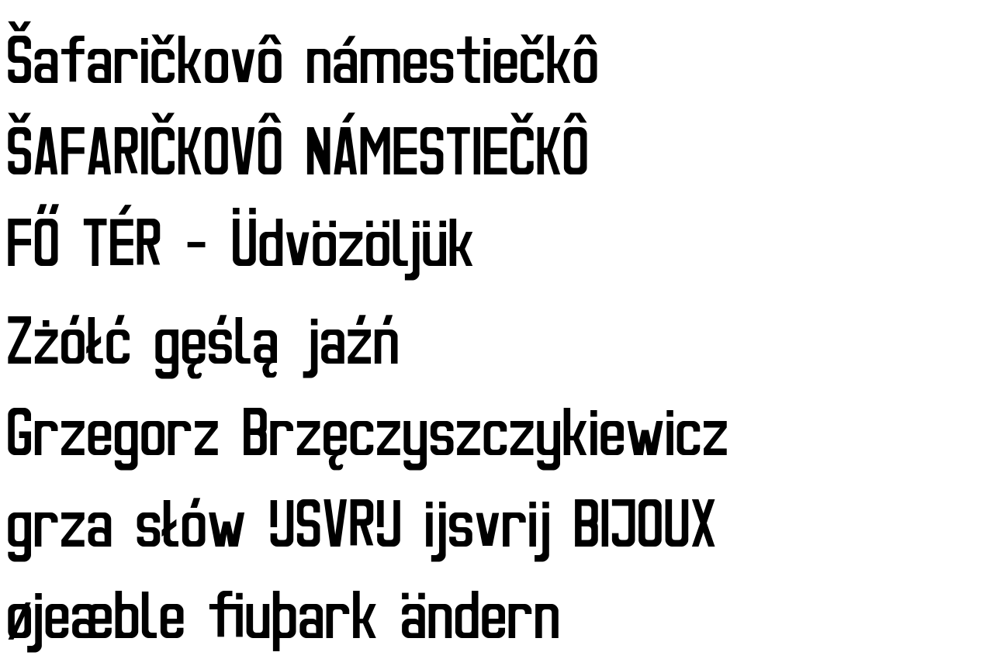

Ulica font
==========

Ulica is an Open Type font based on a font used in Czech and Slovak
street signs. This font, however, supports not only Czech and Slovak
languages, but also Polish, Hungarian and more.

The font is licensed under the SIL Open Font License, Version 1.1,
see LICENSE for the details.
